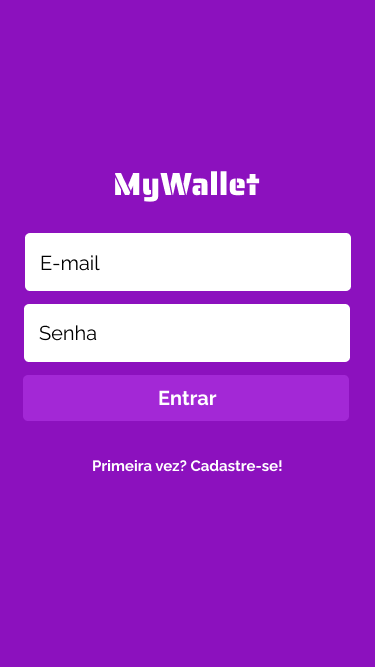
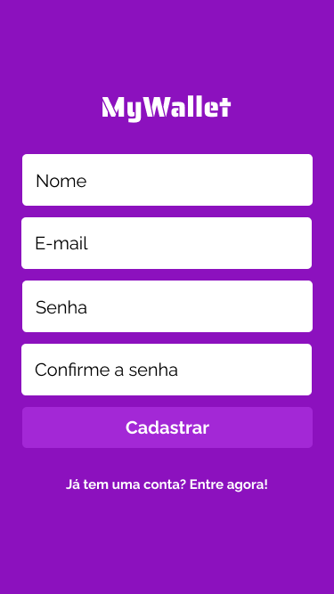
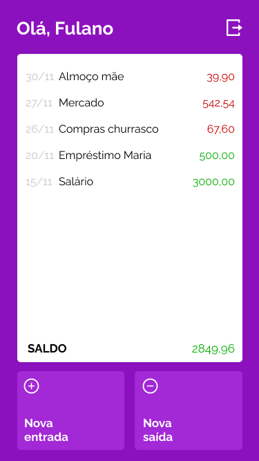

# My Wallet
<table align="center">
  <tr>
    <td align="center" style="padding: 0; margin: 0;">
      
    </td>
    <td align="center" style="padding: 0; margin: 0;">
      
    </td>
    <td align="center" style="padding: 0; margin: 0;">
      
    </td>
  </tr>
</table>

<table align="center">
  <tr>
    <td align="center" style="padding: 0; margin: 0;">
      
    </td>
    <td align="center" style="padding: 0; margin: 0;">
      
    </td>
    <td align="center" style="padding: 0; margin: 0;">
      
  </tr>
</table>

## Sobre

My Wallet é uma carteira digital para registro de entrada e saída de valores, para controle de gastos.


- [Deploy](https://my-wallet-smoky.vercel.app/)

Este é um projeto em [React.js](https://pt-br.legacy.reactjs.org/docs/getting-started.html), [Node.js](https://nodejs.org/), e banco no [MongoDb](https://www.mongodb.com/pt-br)


## Instalação

Tenha clonado os dois arquivos, back-end - e front-end

```bash
   git clone https://https://github.com/davidsauner/MyWallet
   
```

### 1 - Instale as dependencias
```bash
  npm install
```
### 2 - Configure o .env
configure as variáveis de ambiente necessárias tanto no back-end e front-end.
deixando com .env.example com o nome da variavel.

### 3 - Execute o projeto

```bash
  npm start
```
